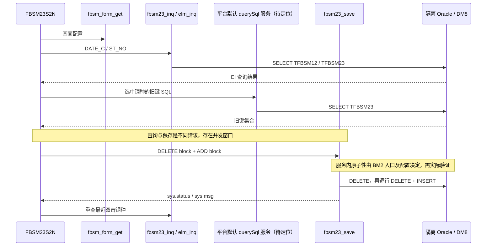

# 首条 DM8 试点业务链：每日配料规则维护

范围更新：用户已明确仅负责应用/后台 SQL 转换。本文件的完整运行试点、构建包和测试数据需求保留为其他阶段参考，不再作为当前源码转换的前置条件；当前执行范围见[SQL 转换范围](<D:/work/company/太钢二炼钢/analysis/dameng-migration/执行准备与资料清单.md>)。

状态：已完成当前源码追踪和验证设计；未改业务代码、未连接数据库、未运行 Oracle/DM8 业务验证。采样日期：2026-09-04。BM2 的连接、命令、模型、参数绑定、分页、类型转换和事务已适配达梦，按用户确认作为前提；下面检查的是这些能力在具体业务请求中的使用和效果。

## 1. 选择结论与边界

建议首条试点使用 **FBSM23S2N「每日配料规则维护」：查询日期下的钢种 → 查看已有规则 → 将编辑后的规则覆盖到选定钢种 → 重新查询核对**。当前可见业务链只读 TFBSM12，读写 TFBSM23，有前端 SQL、EI 服务、参数绑定、批量删除后新增和错误返回，范围小且能检验一次完整的读写结果。不能因只有两张表就认定低业务风险：下游配料计算 [fbsm17_col.cpp](D:/work/company/太钢二炼钢/Server/FBSM/p_fbsm_13430/fbsm17_col.cpp:490) 使用 TFBSM23 排除不符合规则的物料，试点必须放在隔离测试环境，使用专用测试钢种/日期，不连接实际生产计算或外部系统。

比较项：同模块 [FBSM21S2N](D:/work/company/太钢二炼钢/Client/xr-fbsm/src/views/FBSM21S2N/FBSM21S2N.vue:123) 是模型配料库存查询，适合先做连通和读取冒烟验证，但页面没有保存动作，不能单独证明写入和回滚。因此用 FBSM23S2N 作首条读写试点，并将主查询、明细查询作为前置小步骤。

这是一条规则维护链，**不是完整的配料计算/生产下发链**。当前可见三个业务服务未直接调用外部服务或过程；库内触发器、平台初始化/默认查询服务及部署侧任务仍未知，必须取得定义后才能界定完整副作用。

## 2. 从页面到数据库的证据

| 步骤 | 输入与调用 | 后端和数据库行为 | 输出与证据 |
|---|---|---|---|
| 页面初始化 | formPartition、formName=FBSM23S2N；调用 fbsm_form_get | 委托 `BE2::CFormDevConfig::GetFormDevConfig`；实际配置表及字典 SQL 不在该函数内 | 表单、查询条件、网格配置。前端 [39](D:/work/company/太钢二炼钢/Client/xr-fbsm/src/views/FBSM23S2N/FBSM23S2N.ts:39)、[190](D:/work/company/太钢二炼钢/Client/xr-fbsm/src/views/FBSM23S2N/FBSM23S2N.ts:190)，后端 [25](D:/work/company/太钢二炼钢/Server/FBSM/p_fbsm_13400/fbsm_form_get.cpp:25) |
| 主列表查询 | F2 或初始化调用 query_Info；第一个 EI block 的 DATE_C | `fbsm23_inq → f_fbsm23_inq`；DATE_C 去前两位取六位；按 ST_NO/MATERIAL_CODE/DATE_C 分组，SUM(FURNACE_COUNT)，读 TFBSM12 | 返回第一个 block，合并 gridviewMain。前端 [230](D:/work/company/太钢二炼钢/Client/xr-fbsm/src/views/FBSM23S2N/FBSM23S2N.ts:230)，后端 [23](D:/work/company/太钢二炼钢/Server/FBSM/p_fbsm_13400/fbsm23_inq.cpp:23)、[32](D:/work/company/太钢二炼钢/Server/FBSM/p_fbsm_13400/fbsm23_inq.cpp:32) |
| 明细查询 | 双击主列表行；MAIN block，至少包含 ST_NO | `fbsm23_elm_inq → f_fbsm23_elm_inq`；ST_NO TrimOrBlank/ToUpper，读 TFBSM23 | ST_NO、BACK_C2、上下限、MUST_DO_FLAG、VALUE_MAX/MIN；合并 gridView1。前端 [150](D:/work/company/太钢二炼钢/Client/xr-fbsm/src/views/FBSM23S2N/FBSM23S2N.ts:150)、[161](D:/work/company/太钢二炼钢/Client/xr-fbsm/src/views/FBSM23S2N/FBSM23S2N.ts:161)，后端 [24](D:/work/company/太钢二炼钢/Server/FBSM/p_fbsm_13400/fbsm23_elm_inq.cpp:24)、[30](D:/work/company/太钢二炼钢/Server/FBSM/p_fbsm_13400/fbsm23_elm_inq.cpp:30) |
| 保存前查询旧键 | F6；将选中 ST_NO 拼入 `SELECT ST_NO,BACK_C2 FROM TFBSM23 WHERE ST_NO IN (...)`，调用 `querySql('',querySql)` | 类型声明说明 svcName 为空使用平台默认系统服务；具体服务名/分区解析不在本地声明中，不能直接认定它就是 gc00_ExcQrySql | 旧记录数组，用于构造删除 block。前端 [291](D:/work/company/太钢二炼钢/Client/xr-fbsm/src/views/FBSM23S2N/FBSM23S2N.ts:291)、[295](D:/work/company/太钢二炼钢/Client/xr-fbsm/src/views/FBSM23S2N/FBSM23S2N.ts:295)，平台声明 [4658](D:/work/company/太钢二炼钢/Client/xr-fbsm/@mf-types/ERX/index.d.ts:4658) |
| 组合保存请求 | 先加入 TFBSM23_DELETE，后加入 TFBSM23_ADD；新增行=选中左行×右侧全部规则；ST_NO/MATERIAL_CODE 取左行，其余取右行 | `fbsm23_save → f_fbsm23_save` 按收到的 block 顺序执行；后缀 DELETE/ADD/MODIFY 分派至 del/ins/upd | 返回系统状态，前端成功后按最近双击行重查右侧。前端 [306](D:/work/company/太钢二炼钢/Client/xr-fbsm/src/views/FBSM23S2N/FBSM23S2N.ts:306)、[315](D:/work/company/太钢二炼钢/Client/xr-fbsm/src/views/FBSM23S2N/FBSM23S2N.ts:315)、[330](D:/work/company/太钢二炼钢/Client/xr-fbsm/src/views/FBSM23S2N/FBSM23S2N.ts:330)，后端 [226](D:/work/company/太钢二炼钢/Server/FBSM/p_fbsm_13400/fbsm23_save.cpp:226) |
| 删除旧规则 | DELETE block：ST_NO、BACK_C2 | f_fbsm23_del 按这两列执行 DELETE；未指定上下限 | [189](D:/work/company/太钢二炼钢/Server/FBSM/p_fbsm_13400/fbsm23_save.cpp:189) |
| 插入新规则 | ADD block：ST_NO、BACK_C2、UPPER_LIMIT_VALUE、LOWER_LIMIT_VALUE、MUST_DO_FLAG、VALUE_MAX、VALUE_MIN、MATERIAL_CODE | f_fbsm23_ins 每行先按 ST_NO/BACK_C2/上下限四列删，再 INSERT；操作人和创建时间用 Parameters.Set，其余字段拼接 | 写 TFBSM23；创建时间来自应用 CDateTime。证据 [27](D:/work/company/太钢二炼钢/Server/FBSM/p_fbsm_13400/fbsm23_save.cpp:27)、[52](D:/work/company/太钢二炼钢/Server/FBSM/p_fbsm_13400/fbsm23_save.cpp:52)、[57](D:/work/company/太钢二炼钢/Server/FBSM/p_fbsm_13400/fbsm23_save.cpp:57)、[61](D:/work/company/太钢二炼钢/Server/FBSM/p_fbsm_13400/fbsm23_save.cpp:61) |
| 服务额外支持的修改 | MODIFY block；当前页面 F6 没有发送它 | f_fbsm23_upd 按 ST_NO/BACK_C2 UPDATE；绑定修改人/时间 | 单列为服务级补充用例，不称页面已覆盖。[130](D:/work/company/太钢二炼钢/Server/FBSM/p_fbsm_13400/fbsm23_save.cpp:130)、[241](D:/work/company/太钢二炼钢/Server/FBSM/p_fbsm_13400/fbsm23_save.cpp:241) |

## 3. 试点要解决的具体问题

下列是源码已证实的行为或待验证条件，不能直接等同于 DM8 不兼容。

1. **数据库方言风险较低，语义风险仍在。** 三个主服务可见 SQL 是 SELECT/SUM/GROUP BY/INSERT/UPDATE/DELETE，未发现 Oracle 专有分支、ROWNUM、序列或存储过程调用。本链以打通运行和数据行为为目标，不能代表全系统 Oracle 特性已处理。字段大小写、未限定 schema、数值字符串、空串/NULL、CHAR 尾空格和隐式转换，要用真实 DDL 与目标实例设置验证，不凭 DM8 名称判断。
2. **字段大多手工拼入 SQL。** 前端旧键查询、后端 ST_NO 条件均直接拼接；后端对部分字段做单引号替换，仅审计字段使用参数绑定。后续改造建议使用用户确认已可用的 BM2 绑定能力；具体绑定类型以 DDL 为准，当前不做猜测性改写。
3. **主列表的钢种选择可能合并。** 主查询按 ST_NO/MATERIAL_CODE/DATE_C 分组，但前端 selection key 和 `lastRawList.find` 仅使用 ST_NO。若同日期同 ST_NO 对应多个 MATERIAL_CODE，须核对实际业务约束和预期；不能仅依据界面显示的行数认定保存数量正确。
4. **保存前旧键查询失败后继续保存。** [296](D:/work/company/太钢二炼钢/Client/xr-fbsm/src/views/FBSM23S2N/FBSM23S2N.ts:296) 只记警告，existingRows 保持空数组，随后仍可进入 ADD；旧规则可能无法彻底删除。它是已有失败路径风险，应在 Oracle 基线先复现并与 DM8 差异分开记录。
5. **事务范围尚未证实。** 保存函数内未见显式 Begin/Commit/Rollback，子函数失败以负值上报，外层仍捕获异常并返回负值。BM2 支持事务不等于这个服务配置保证整批回滚。必须查入口宏/服务事务配置，并在删除成功、后续插入失败后从另一个连接验证整批数据恢复。
6. **键和重复请求尚未证实。** 新增前删除按四列，DELETE/MODIFY 按两列；源码注释“同主键”不构成主键定义。没有真实唯一约束不能判定一对 ST_NO/BACK_C2 能有几条区间规则。重复请求会刷新创建时间，业务字段一致也不等于整个记录完全幂等。
7. **并发覆盖存在跨请求窗口。** 旧键读取发生在保存事务外；另一用户在间隔内增删或改规则，可能造成旧集合覆盖、新旧混合或丢失更新。试点要先确认 Oracle 当前行为，然后决定冲突策略；不能默认每次保存都已有版本检查/锁。
8. **结果判断要查库。** 主查询的状态校验在页面里被注释，[237](D:/work/company/太钢二炼钢/Client/xr-fbsm/src/views/FBSM23S2N/FBSM23S2N.ts:237) 后仍读取 block。保存只刷新最近双击行，不一定覆盖所有勾选目标；验收必须核对全部目标和未选目标。

## 4. 可运行前所需资料

| 所需条件 | 当前结论 | 最小补齐内容 |
|---|---|---|
| 后端编译/运行包 | 当前 Server 路径检索未找到 stdafx.h、CFormDevConfig.h、CDbConnection.h 或完整工程文件；仅有调用方源文件不足以编译 | 与部署版本一致的 BM2 SDK、相关业务头文件/库、编译工程/工具链，或可部署验证的适配后运行包及构建来源 |
| 数据库结构和隐式依赖 | 源码可确认两张显式表名，不能确认实际类型/键/触发器 | TFBSM12、TFBSM23 的 DDL、索引、约束、默认值、触发器、依赖对象；若实际为同义词/视图，提供对应定义 |
| 页面和服务配置 | GetFormDevConfig/默认 querySql 的实现和部署配置未在本链落地 | FBSM23S2N 的表单/字典/查询配置、服务注册/路由和默认查询服务、分区到测试 schema 的解析、事务配置 |
| 运行环境 | 本次未连接，不能声称 Oracle 或 DM8 测试环境可用 | 隔离 Oracle 基线与 DM8 测试库；记录版本、DM8 兼容模式、字符集、大小写、隔离级别；使用受控凭据管理，不把账号密码放入报告 |
| 前端依赖 | 本地是 EFX/ERX/EIX 远端模块调用和类型声明 | 可访问的测试平台远端模块、登录及页面权限、服务映射；构建能完成不替代这些运行条件 |
| 测试数据及业务约束 | 钢种/字段合法值、区间规则键和多物料关系未获确认 | 脱敏基线或人工样本，合法代码、字段边界、唯一性规则；两库相同起始快照及可恢复方式 |

这里只列试点的最小依赖；全项目仍需全部库内程序、JOB、动态配置 SQL 和外部接口清单。

## 5. 分步验证与通过标准

所有用例尚未执行。下面是建议验收口径，不替代业务方确认；故障和并发注入仅在隔离测试库进行。

| 编号 | 操作与观测 | 通过标准/待确认项 |
|---|---|---|
| P01 初始化与路由 | 以测试用户打开页面，确认配置、服务分区和 schema；记录解析到的默认 querySql 服务，不记录凭据 | 页面能初始化，三个业务服务与默认查询命中预期测试库；无意外生产连接 |
| P02 主/明细查询 | 相同日期、钢种；覆盖无数据、多个分组、NULL/空串/尾空格、大小写；比较两库行集合、字段类型、SUM 值 | 行集合和业务值一致；源码没有 ORDER BY，比较时按已确认键排序，不能把偶然显示顺序当合同 |
| P03 单目标覆盖 | TFBSM23 预置仅旧端存在的规则及要替换的规则；右侧编辑后 F6；独立连接重读 | 目标完整等于请求规则，旧规则消失，未选钢种不变，审计人/时间可解释；TFBSM12 不被该保存改写 |
| P04 多目标覆盖 | 两个目标钢种、每个两条规则；保留第三个未选钢种；另加同钢种多 MATERIAL_CODE 样本 | 按确认业务键核对每个目标，不能简单把期望行数定成笛卡尔积而忽略键合并；多物料行为需业务确认 |
| P05 中途失败回滚 | 请求先含可成功 DELETE/ADD，再含空 ST_NO 触发明确应用错误；再用已知 DDL 约束构造后续插入失败 | 返回失败；另一个连接观察请求前后所有目标完全恢复，无已删未插、无部分成功；同时验证错误能传到 UI |
| P06 预查询失败 | 让测试默认 querySql 明确失败或超时；观察 F6 后是否仍发 fbsm23_save | 记录当前行为；建议最终验收为旧集合未成功取得时不覆盖写入。若 Oracle 也失败，登记已有缺陷并另行确定修复范围 |
| P07 重复请求 | 相同请求连续两次、响应丢失后重发；分别比较业务字段与审计字段 | 不生成额外重复/丢失业务规则；审计时间是否允许变化需明确。不把“无报错”认定为幂等通过 |
| P08 并发 | 两连接同钢种不同规则、不同钢种规则；在旧键查询后插入第三方变更；使用屏障固定交错顺序 | 不发生部分提交/混合集合；同钢种覆盖还是拒绝冲突由业务确认后断言。记录锁等待/死锁/重试结果，不预设已支持自动重试 |
| P09 类型边界 | 依据 DDL 测数字零/负数/小数精度/最大值、NULL/空串、中文与长度边界、合法数据中的引号 | Oracle 与 DM8 存储值、返回类型和错误行为符合确认口径；非法值失败且整批不残留，避免只测返回字符串 |
| P10 服务级 MODIFY | 直接测试合法 TFBSM23_MODIFY block，覆盖多区间和不存在键，检查受影响行 | 按确认键验证更新范围；该用例是服务补充，不伪装成当前页面动作 |
| P11 性能与恢复 | 相同数据量和批量选中规模，重复查询/保存，比较耗时、执行计划、索引和锁等待；每次验证后恢复样本快照 | 先取得 Oracle 基线，再由项目确认可接受阈值；当前不编造毫秒/并发 SLA。恢复后核对业务行集合和数量 |

成功证据至少包括：构建/部署版本，脱敏 DDL 摘要和库设置，样本编号，两库输入/业务输出对照，失败后的独立连接核对结果，并发交错记录和性能基线。只跑 SQL 客户端或只通过 TypeScript 构建都不能证明整个页面到数据库的试点成功。

## 6. 此试点不覆盖的风险

- CModel 自动生成 SQL、分页、Oracle/DB2 DB_KIND 分支、序列取号和锁、LOB/复杂日期函数、存储过程/JOB 等需要后续独立切片，本链未覆盖。
- 配料计算与生产下发未纳入，TFBSM23 的下游业务效果仍须在后续业务验收验证；不能把本链通过扩展成整个配料业务通过。
- 21 个外部系统的接口、WinForms/甘特图后台、MMTP/GCPM 库内配置 SQL 等全项目内容不因本链通过而免检。
- 本次属于可审查的试点设计。实施修复前先把真实 DDL、事务边界、Oracle 基线和既有缺陷分清，再形成具体改造项；没有执行生产变更。

机器可核验的引用、编码和哈希见 [pilot-evidence.json](D:/work/company/太钢二炼钢/analysis/dameng-migration/pilot-evidence.json)。本次重新读取发现查询文件/初始化文件使用 GB18030，保存文件使用 UTF-8；后续修改应保持各文件原编码，不能整目录统一转码。
